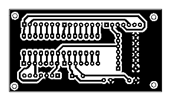
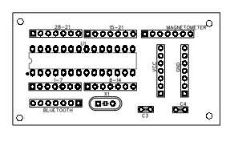

# Underground Wire Detector Robot

A robotic car system for detecting and mapping underground wires using a GY-271 HMC5883L magnetometer, HC-05 Bluetooth module, ATmega328p microcontroller, and real-time Python data visualization.

---

## Features

- Detects magnetic fields generated by underground wires beneath a surface.
- Plots and analyzes data live on your computer via Bluetooth.
- Portable, automated scanning with a robotic car.

## Folder Contents

- `main.c` – C source code for ATmega328p: collects sensor data and sends it over Bluetooth.
- `Makefile` – For compiling the embedded firmware.
- `main.hex` – Compiled Intel HEX file ready for flashing to ATmega328p.
- `graphs.py` – Python script that connects to Bluetooth, receives, and plots data in real time.
- (Other files are compilation outputs and for reference.)

---

## Quick Start

1. **Upload Firmware to Microcontroller**
   - Use a programmer (e.g., USBasp, Arduino as ISP, etc.) and `main.hex` to flash the ATmega328p.

2. **Set up the Hardware**
   - Connect the GY-271 magnetometer and HC-05 Bluetooth module to the ATmega328p as per your circuit diagram.
   - Mount the system on your robotic car.
   - Power the car and ensure all connections are secure.

3. **Pair with Bluetooth**
   - On your PC, enable Bluetooth and pair with the device named `ROBOT` (password: `1234`).

4. **Run the Data Collection Script**
   - Make sure Python is installed.
   - Open a terminal in this project folder and run:
     ```
     python graphs.py
     ```
   - The script will connect via Bluetooth and display real-time magnetic field data.

---

## Hardware Components

- Robotic Car with geared motors and chassis
- GY-271 HMC5883L 3-Axis Magnetometer
- HC-05 Bluetooth Module
- ATmega328p Microcontroller
- 12V Battery pack
- PC or Laptop with Bluetooth

---

## PCB Diagrams

### PCB Bottom View



### PCB Top View



---

## Troubleshooting

- **Cannot connect to Bluetooth:**  
  Ensure your PC Bluetooth is enabled and the correct pairing code (`1234`) is used.
- **No data received:**  
  Check wiring, make sure the ATmega328p is running the firmware, and the car is powered on.

---

## Notes

- Avoid strong external magnetic sources during operation to get accurate readings.
- For enhanced results, adjust the car’s speed and sampling rate as needed in the code.

---

## License

Distributed under the MIT License.

---

*Developed by Sandadini*
